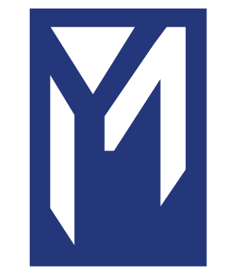

#YaleMakes

We run workshops, host speakers, and support student projects at the intersection of technology and the arts.

We believe that learning about how design works in different disciplines can help people uncover creative solutions and have fun!

### Core Team

- Founding Team
    - Megan Valentine (Computing and the Arts)
    - Artem Osherov (Molecular, Cellular, Developmental Biology / English)
    - Cameron Yick (Electrical Engineering/Computer Science)

- Incoming Team 
    - Sarah Sukin
    - Julia Ma

### Invited Speakers 

Reverse chronological

#### 2016
- Rebecca Ronsivalle (Mucca Design)
- Spencer Luckey (Luckey Climbers)
- Max Galka (Metrocosm.com)

#### 2015
- Yong Zhao / Wanting Zhang (Junzi Kitchen)
- Erik Kennedy(Ex-Microsoft)
- Paul Chung (Design @ Yale)
- Les Smith (Pierson College Printing)
- Work.Shop Rhode Island
- Bianka Ukleja (Yale College 2018)

#### 2014
- Lauren Hom (Homsweethom Design)
- Alexander Bailey (Yale College 2017)

You could be next! 

### Attributions
- _YM Logo designed by Megan Valentine_
- _Splat Logo designed by Christina Chi Zhang_